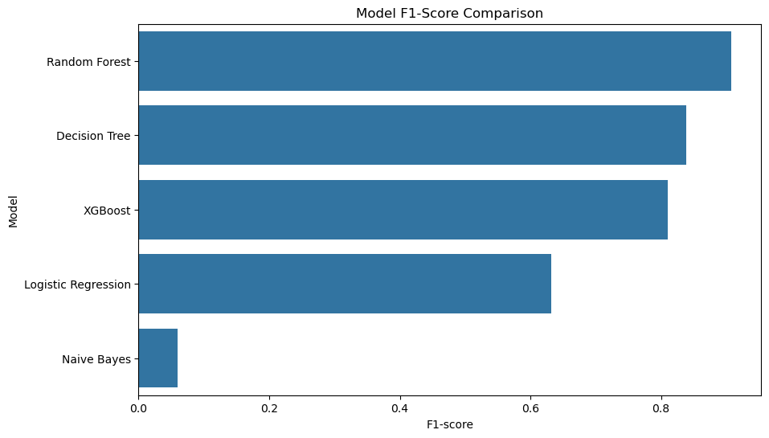
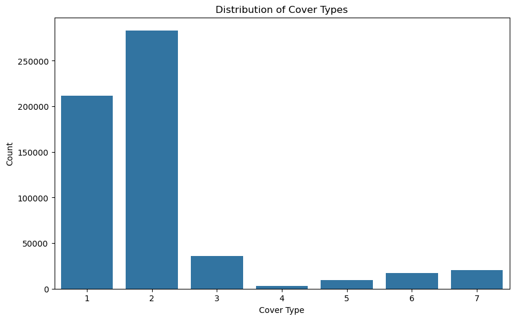
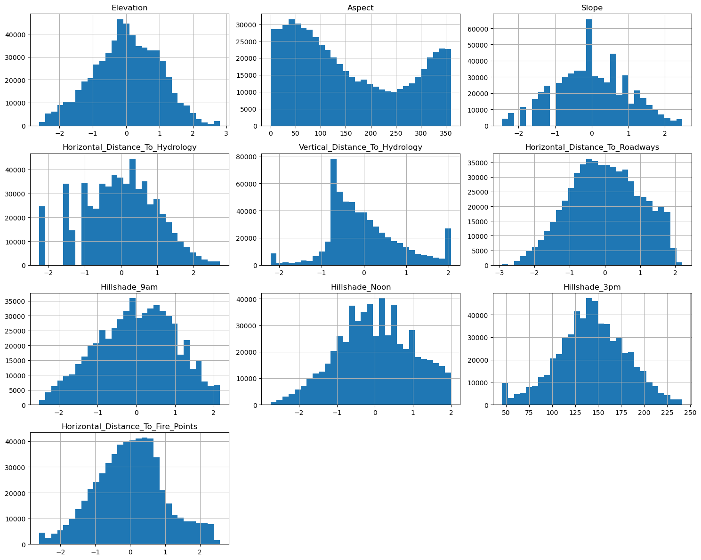
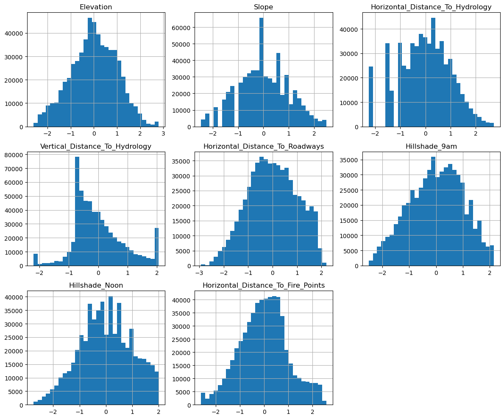

# Forest Cover Type Prediction 🌲

This project builds a complete machine learning pipeline to predict the forest cover type (one of seven types) based on cartographic data. The model is trained in a Jupyter Notebook, and a live, interactive web app is built with Gradio and deployed to Hugging Face Spaces.

[](https://huggingface.co/spaces/venmugilrajan/Forest_cover_type)

## 🚀 Live Demo

You can try the live prediction app here:
**[Hugging Face Space: Forest Cover Type Predictor](https://huggingface.co/spaces/venmugilrajan/Forest_cover_type)**

-----

## 📋 Project Pipeline

The project follows these key steps:

1.  **Data Loading:** The `covtype.csv` dataset is loaded into a pandas DataFrame.
2.  **Exploratory Data Analysis (EDA):** Analyzed the target variable distribution and the distributions of 10 continuous features.
3.  **Data Preprocessing:**
      * **Feature Transformation:** Used `PowerTransformer` on 8 skewed continuous features to make them more "normal-like."
      * **Scaling:** Scaled all continuous features using `StandardScaler`.
      * **Label Encoding:** Encoded the target variable (`Cover_Type`) from 1-7 to 0-6 using `LabelEncoder`.
4.  **Model Training:** Trained and evaluated five different classification models to find the best performer.
5.  **Model Selection:** **Random Forest** was chosen as the final model due to its high F1-score.
6.  **Model Saving:** The best model (`best_rf`), the scaler (`scaler.pkl`), the power transformer (`pt.pkl`), and the label encoder (`le.pkl`) were all saved to disk using `joblib`.
7.  **Deployment:** A `app.py` file was created using **Gradio** to load the saved `.pkl` files and serve a user-friendly web interface.

-----

## 📊 Exploratory Data Analysis (EDA)

### Distribution of Cover Types

The dataset is highly imbalanced. **Class 1 (Spruce/Fir)** and **Class 2 (Lodgepole Pine)** make up the vast majority of the samples, which requires using metrics like the weighted F1-score for fair model evaluation.

### Feature Distributions

Most of the 10 continuous features were heavily skewed. A `PowerTransformer` was applied to 8 of them to normalize their distributions, which helps improve the performance of many models.

**Before Transformation:**

**After Transformation:**

-----

## 🏆 Model Performance

A comparison of five different models showed that **Random Forest** was the clear winner, with the highest weighted F1-score of over 0.90. Naive Bayes performed very poorly due to the nature of the data.

...**Random Forest** was the clear winner...

-----
### Distribution of Cover Types
The dataset is highly imbalanced...


### Feature Distributions
...A `PowerTransformer` was applied to 8 of them...

**Before Transformation:**


**After Transformation:**


---


## ⚙️ Tech Stack

  * **Data Analysis:** `pandas`, `numpy`
  * **Data Visualization:** `matplotlib`, `seaborn`
  * **ML Pipeline:** `scikit-learn` (for `PowerTransformer`, `StandardScaler`, `LabelEncoder`, and all models)
  * **ML Model:** `xgboost` (for `XGBClassifier`)
  * **Web App:** `gradio`
  * **Model Saving:** `joblib`

-----

## 📂 Repository Structure

```
.
├── .gitattributes         # Configures Git LFS for large files
├── .gitignore             # Ignores large files like .csv and .pkl
├── Forest Cover.ipynb     # Jupyter Notebook with all analysis and training
├── app.py                 # The Gradio app for deployment
├── requirements.txt       # All required Python libraries
│
├── covtype.csv            # (Tracked by LFS) The raw dataset
├── forest_cover_model.pkl # (Tracked by LFS) The saved RandomForest model
├── label_encoder.pkl      # (Tracked by LFS) The saved LabelEncoder
├── power_transformer.pkl  # (Tracked by LFS) The saved PowerTransformer
└── scaler.pkl             # (Tracked by LFS) The saved StandardScaler
```

**Note:** The `.csv` and `.pkl` files are tracked using **Git LFS** due to their large size.

-----

## 💻 How to Run Locally

1.  **Clone the repository:**

    ```bash
    git clone https://github.com/venmugilrajan/Forest-Cover-Type-Prediction.git
    cd Forest-Cover-Type-Prediction
    ```

2.  **Install Git LFS:**

      * You must have Git LFS installed to download the large model and data files.
      * Download from [git-lfs.github.com](https://git-lfs.github.com)
      * Initialize it in the repo:

    <!-- end list -->

    ```bash
    git lfs install
    ```

3.  **Pull the large files:**

    ```bash
    git lfs pull
    ```

4.  **Create a virtual environment (recommended):**

    ```bash
    python -m venv myenv
    source myenv/bin/activate  # On Windows: myenv\Scripts\activate
    ```

5.  **Install the required libraries:**

    ```bash
    pip install -r requirements.txt
    ```

6.  **Run the Gradio app:**

    ```bash
    python app.py
    ```

    This will launch the app, and you can access it at a local URL (like `http://127.0.0.1:7860`).
